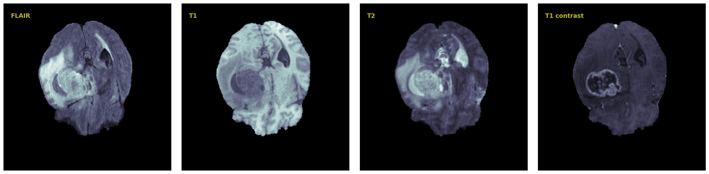

# Segmentation Models Comparison on Brats2020

## Data overview

Each sample contains T1, post-contrast T1-weighted, T2-weighted and FLAIR scan modalities. And annotations with the GD-enhancing tumor (ET — label 4), the peritumoral edema (ED — label 2), and the necrotic and non-enhancing tumor core.

## Results
Unet results after 50 epochs.
 